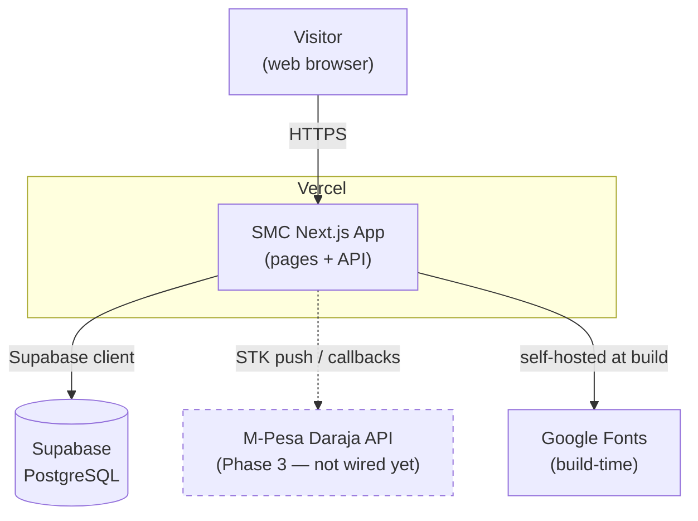
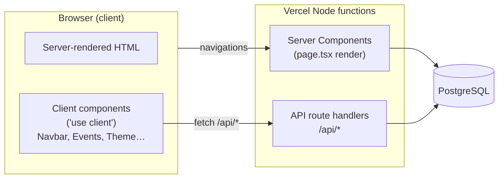
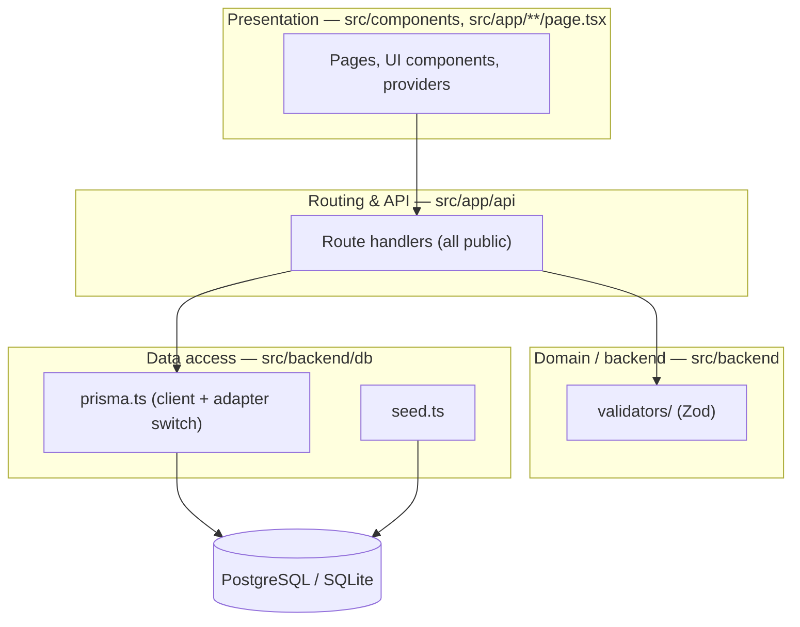
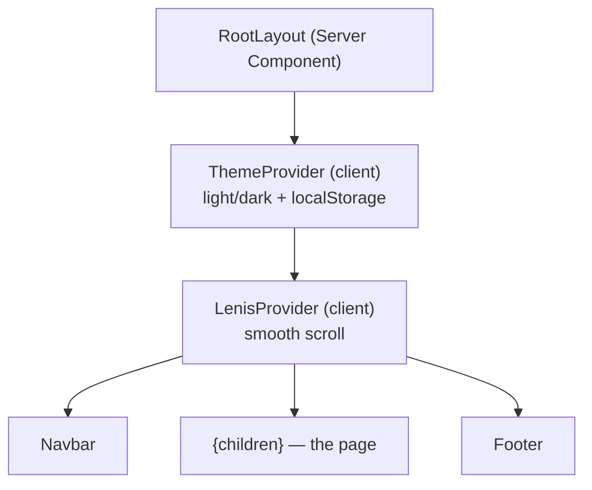
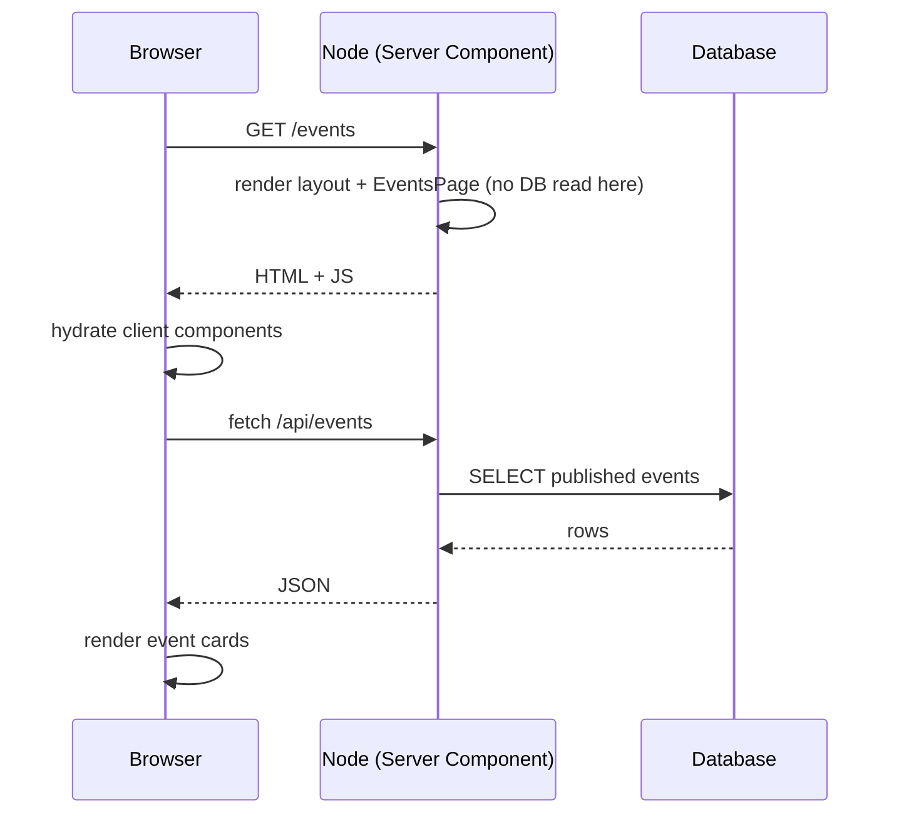
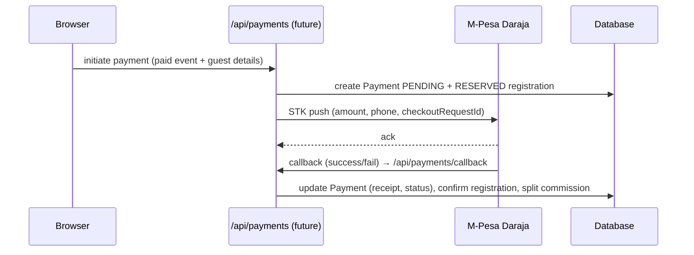
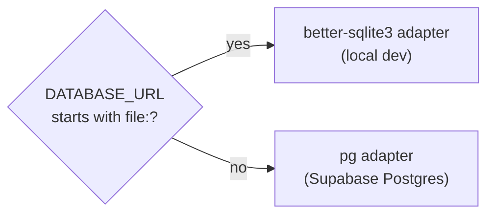
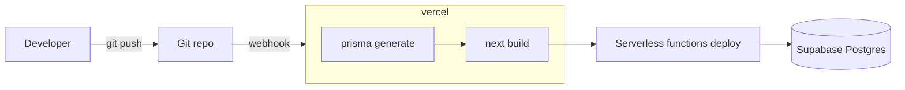

# SMC Website — System Architecture

> **Project:** Strathmore Marketing Club (SMC) — "The Agency"
> **What this doc is:** The *runtime* view of the system — how the pieces fit together, how a request flows end to end, how it's deployed, and how it's secured.
> **Companion doc:** [`SCHEMA.md`](SCHEMA.md) holds the *structural* reference (database tables, field-by-field, full API list). This doc links to it instead of repeating it.
>
> **Last updated:** 2026-08-30 · **Maintainers:** SMC dev team · **If you change how the system works, update this file in the same PR.**

---

## Table of contents

1. [Architecture at a glance](#1-architecture-at-a-glance)
2. [System context](#2-system-context)
3. [Containers & runtimes](#3-containers--runtimes)
4. [Layered architecture](#4-layered-architecture)
5. [Rendering & state model](#5-rendering--state-model)
6. [Key request flows](#6-key-request-flows)
7. [Data architecture](#7-data-architecture)
8. [Security architecture](#8-security-architecture)
9. [Deployment & infrastructure](#9-deployment--infrastructure)
10. [Cross-cutting concerns](#10-cross-cutting-concerns)
11. [Scalability & performance](#11-scalability--performance)
12. [Known limitations & tech debt](#12-known-limitations--tech-debt)
13. [Keeping this doc current](#13-keeping-this-doc-current)

---

## 1. Architecture at a glance

A single **Next.js 16** application (App Router) deployed to **Vercel**, talking to a **PostgreSQL** database (**Supabase**). There is no separate backend service — the API lives inside the same Next app as route handlers. Application code reads and writes through the **Supabase client**; Prisma remains as the **schema, migration, and seeding** tool only.

| Concern | Approach |
|---|---|
| App model | One Next.js app: server-rendered pages + colocated API route handlers. |
| Auth | **Supabase Auth** for the admin portal, enforced by `src/middleware.ts` over `/admin/*`. The **public** side stays anonymous — event RSVP needs no account. |
| Data | **Supabase client** (`@supabase/supabase-js` / `@supabase/ssr`) at runtime. **Prisma** owns `schema.prisma`, migrations, and the seed script. |
| Content | **Mostly DB-backed:** events, past events, portfolio, team, and homepage copy all live in Postgres and are edited through `/admin`. Only `membership` and shared config (e.g. category taxonomies) remain static (see [§7](#7-data-architecture)). |
| Runtime | All app code runs as **Node** serverless functions (page render + API); the browser runs the client islands. **Middleware** runs on `/admin/*` to refresh the Supabase session and gate access. |
| Deploy | Git push → Vercel build (`prisma generate` + `next build`) → serverless deploy. |

---

## 2. System context

Who and what the system talks to.



Dashed = planned, not built. Public visitors are anonymous; **admins** authenticate through Supabase Auth to reach `/admin/*`. See [`SCHEMA.md` §12](SCHEMA.md#12-roadmap--phases) for phases.

---

## 3. Containers & runtimes

The "one app" runs across **two runtime contexts** — the browser and Vercel's Node serverless functions — plus **middleware** on `/admin/*`, which refreshes the Supabase session and redirects unauthenticated visitors to `/admin/login`.



| Runtime | Runs | Why it matters |
|---|---|---|
| **Node serverless** (Server Components + `/api/*`) | Page rendering, all DB access, RSVP handling, Zod validation. | Full Node APIs available. Each invocation is **stateless** — no in-memory state survives between requests. |
| **Browser** (`"use client"` components) | Interactivity: nav, theme, events list, portfolio grid, the RSVP form. | Talks back to the server via `fetch('/api/*')`. The Supabase browser client handles the **admin login** session only. |

> ℹ️ `GET` routes are **public** and return published records only. Every **write** (`POST`/`PATCH`/`DELETE`) on the admin APIs calls `supabase.auth.getUser()` and returns `401` without a session. The RSVP handler stays public and does not trust client state — it re-validates the body, re-checks capacity, and enforces email dedupe **server-side** on every call.

---

## 4. Layered architecture



| Layer | Folder | Responsibility |
|---|---|---|
| Presentation | `src/app/**/page.tsx`, `src/components/` | Render UI; client islands handle interaction. |
| Routing & API | `src/app/api/` | HTTP entry points. Public reads; writes guarded by a Supabase session check. |
| Domain / backend | `src/backend/validators/` | Input validation (Zod). |
| Data access | `src/lib/supabase/` | Request-scoped Supabase clients (`server.ts` / `client.ts`). |
| Schema & seeding | `src/backend/db/`, `prisma/` | Prisma schema, migrations, and the seed script. |
| Persistence | Supabase Postgres | Source of truth for events, projects, team, registrations, payments. |

Rule of thumb: **client components never query the database directly.** They call `/api/*`; the handler validates, then uses the Supabase client. Server components may query Supabase directly via `src/lib/supabase/server.ts`.

---

## 5. Rendering & state model

**Server Components by default; client "islands" for interactivity.** The root layout ([`src/app/layout.tsx`](src/app/layout.tsx)) wraps the app in a fixed provider order:



State propagation:

- **Theme** — `ThemeProvider` keeps `light|dark` in React state + `localStorage`, toggling a `dark` class on `<html>`. An inline script in `<head>` applies the stored theme **before hydration** to avoid a flash of the wrong theme (anti-FOUC).
- **Data fetching** — the events page is a thin server component that renders the `Events` client component, which fetches `/api/events` on mount (client-side). It is **not** server-rendered with data; it hydrates then fetches.
- **RSVP form state** — the RSVP form (name / email / optional phone) is **local component state** inside `Events.tsx`. On submit it POSTs to `/api/events/[slug]/rsvp` and renders a success or error state inline; there is no global/session state involved.

> The **public** Navbar shows a single static "Join the Club" link (→ `/membership`), not a sign-in/out toggle — public pages never read auth state. Admin session handling lives entirely in `src/middleware.ts` and the `/admin` route group.

---

## 6. Key request flows

### 6.1 First page load (SSR + hydrate)



There is no Edge middleware in the path — the browser hits the Node function directly.

### 6.2 Anonymous event RSVP (free event, capacity-safe)

Source: [`Events.tsx`](src/components/Events.tsx) + [`/api/events/[slug]/rsvp`](src/app/api/events/[slug]/rsvp/route.ts).

```mermaid
sequenceDiagram
    participant B as Browser (RSVP form)
    participant API as /api/events/[slug]/rsvp (Node)
    participant D as Database

    B->>B: open event, fill name + email (+ optional phone)
    B->>API: POST {name, email, phone?}
    API->>API: rsvpSchema.safeParse → 400 if invalid
    API->>D: load event (+ active reg count)
    API->>API: 404 if unpublished · 400 if PAID
    API->>D: find existing reg by (eventId, lowercased email)
    alt active duplicate
        API-->>B: 409 "already registered"
    else new or previously cancelled
        API->>D: $transaction { re-count; if full throw; INSERT/UPDATE reg CONFIRMED }
        alt under capacity
            D-->>API: registration
            API-->>B: 201 created (or 200 re-activated)
            B->>B: show "You're registered" + refresh spotsRemaining
        else full
            API-->>B: 409 "Event is full"
            B->>B: show inline error
        end
    end
```

Two integrity guarantees live in this flow:
- **Dedupe** — the `@@unique([eventId, guestEmail])` constraint plus an explicit lookup means one email can hold only one active RSVP per event.
- **No overbooking** — the capacity check runs **inside a Prisma `$transaction`** that re-counts active registrations right before insert, so two simultaneous RSVPs can't both claim the last seat.

### 6.3 Payment (Phase 3 — planned)

Not implemented. The intended shape, based on the `Payment` model and `MPESA_*` env placeholders:



---

## 7. Data architecture

Full table-by-table detail lives in [`SCHEMA.md` §5](SCHEMA.md#5-database-schema). Architecturally, two things matter:

**1. Two content sources.** Not all "content" is in the database:

| Content | Source | Edited by |
|---|---|---|
| Events, past events, registrations, payments | **Database** | `/admin` UI, seed script, DB tools |
| Portfolio projects, Team members, Homepage copy | **Database** | `/admin` UI, seed script |
| Membership copy, category taxonomies | **Static TS files** in `src/data/` | Code change + redeploy |

Editable content moved into the database so officers can update it through `/admin` without a redeploy. What remains in `src/data/` is either rarely-changing copy (`membership.ts`) or shared config the code depends on (`eventCategories.ts`, `projectCategories.ts`). `src/data/events.ts` is **legacy/unused** — events render from the DB now.

**2. Runtime adapter switch.** Prisma is no longer on the request path, but the seed and migration tooling still uses a lazy Prisma singleton ([`src/backend/db/prisma.ts`](src/backend/db/prisma.ts)) that picks its driver from `DATABASE_URL`:



The client is created on first use and cached on `globalThis` so dev hot-reloads and serverless invocations don't open a flood of connections.

---

## 8. Security architecture

The system has **two trust zones**: a fully public site (browse + RSVP, no account) and an **authenticated admin portal** backed by Supabase Auth. Security work therefore splits between **guarding admin writes** and **input integrity / abuse resistance** on the public RSVP path.

| Control | Where | Detail |
|---|---|---|
| **Admin access** | `src/middleware.ts` | Every `/admin/*` path except `/admin/login` requires a Supabase session, else redirect to login. Admin API writes independently re-check `supabase.auth.getUser()` → `401`. |
| **Input validation** | `validators/rsvp.ts` (Zod) | RSVP payload (`name` ≥ 2, valid `email`, optional `phone`) validated before any DB work; invalid → `400`. |
| **RSVP dedupe** | rsvp handler + DB unique | `@@unique([eventId, guestEmail])`; email lowercased. One active RSVP per email per event; duplicate → `409`. |
| **Capacity integrity** | rsvp handler | Active-registration re-count **inside a Prisma `$transaction`** prevents overbooking races. |
| **Money integrity** | schema | Currency stored as integer KES — no float rounding. |
| **Secrets** | env vars | `DATABASE_URL`, `MPESA_*` injected via Vercel/`.env`; `.env` is gitignored. `NEXT_PUBLIC_SUPABASE_*` are publishable by design — the anon key is safe to ship, so row protection must not rely on it staying secret. |

**Trust boundary:** the browser is untrusted → the RSVP API re-validates the body, re-checks capacity, and enforces dedupe **server-side** on every request. Nothing relies on client-supplied state being honest.

**Current gaps** (see [§12](#12-known-limitations--tech-debt)):
- **No rate limiting** on the public RSVP endpoint — a bot could spam registrations or probe capacity. **Add per-IP throttling before launch** (Vercel rate-limit / token bucket).
- **Email is unverified** — anyone can RSVP with any address; there's no confirmation step. Add a confirmation email/token if RSVP integrity matters.
- **No CSRF protection** on the RSVP POST — it's a state-changing public endpoint; add an origin/`Sec-Fetch` check if it ever carries weight.

---

## 9. Deployment & infrastructure



| Aspect | Detail |
|---|---|
| **Host** | Vercel (preview deploy per branch, production on main). |
| **Build** | `npm run build` = `prisma generate --config prisma/prisma.config.ts && next build`. |
| **DB** | Supabase Postgres. Use the **session pooler (5432)** for Prisma, or the **transaction pooler (6543) + `?pgbouncer=true`** for high-traffic serverless (see `.env.example`). |
| **Migrations** | `prisma migrate`. Commit `schema.prisma` + the generated migration **before** deploy; run migrations against prod as part of release. ⚠️ The `remove_auth_anonymous_rsvp` migration **drops `User`** and adds `NOT NULL` guest columns — safe on a fresh DB, needs a backfill on a populated one. |
| **Config** | `prisma/prisma.config.ts` loads `.env` and points the CLI at the schema + seed. |
| **Env** | `DATABASE_URL` required; `MPESA_*` for Phase 3. Full list in [`SCHEMA.md` §9](SCHEMA.md#9-environment-variables). |

---

## 10. Cross-cutting concerns

| Concern | Implementation |
|---|---|
| **Theming** | `ThemeProvider` (light/dark) + pre-hydration inline script in `layout.tsx` to prevent theme flash; persisted to `localStorage`. |
| **Smooth scroll** | `LenisProvider` wraps the app. |
| **Animation** | Framer Motion throughout; every animated component respects `useReducedMotion()` for accessibility. |
| **Fonts** | League Spartan / Montserrat / Rozha One self-hosted at build via `next/font/google` (`src/lib/fonts.ts`), exposed as CSS variables. |
| **Responsiveness** | Tailwind v4 breakpoints; Navbar has a dedicated mobile menu. |
| **Path alias** | `@/*` → `src/*`. |

---

## 11. Scalability & performance

- **Fully stateless functions** → there's no session store or server-side state to share, so any function instance can serve any request; horizontal scale is trivial.
- **Connection management** → runtime traffic goes over Supabase's HTTP API rather than raw Postgres connections, which sidesteps serverless connection storms; the pooler settings still matter for Prisma migrations and seeding.
- **Overbooking protection** → capacity enforced inside a DB transaction (re-count before insert), not just an app-level check.
- **Static content** → membership copy and category taxonomies ship as JS, no DB round-trip.
- **Watch-outs** → the events and portfolio grids fetch client-side after hydration (no SSR data, so skeletons show first and the cards are invisible to crawlers). Individual case studies at `/portfolio/[slug]` **are** server-rendered; consider the same for the listing pages if SEO matters.

---

## 12. Known limitations & tech debt

| Item | Notes |
|---|---|
| **Payments not implemented** | `Payment` model + `MPESA_*` env exist; no API/UI yet (Phase 3). |
| **No admin UI for events** | Events are managed via the seed script / DB tools only; no in-app editor. |
| **`src/data/events.ts` unused** | Live events come from the DB. Decide: remove or repurpose. |
| **No rate limiting** | The public RSVP endpoint is unthrottled — see [§8](#8-security-architecture). |
| **Unverified RSVP email** | No confirmation step; anyone can RSVP with any email address. |
| **No self-service cancel** | Without a logged-in identity there's no secure way for a guest to cancel an RSVP (email-token cancel is a future option). |
| **Events list not SSR'd** | Fetched after hydration; reconsider for SEO/perf. |

---

## 13. Keeping this doc current

Update **this file** when you change *how the system works* (a new runtime, a new flow, a deploy change). Update [`SCHEMA.md`](SCHEMA.md) when you change *what the data looks like* (tables, fields, endpoints).

Quick checklist for a PR that touches architecture:

- [ ] New flow or endpoint? Add/adjust a sequence diagram in [§6](#6-key-request-flows).
- [ ] New env var or external service? Update [§9](#9-deployment--infrastructure) here **and** `SCHEMA.md` §9.
- [ ] Changed the runtime split (Node/browser) or re-introduced middleware? Update [§3](#3-containers--runtimes).
- [ ] Resolved a [§12](#12-known-limitations--tech-debt) item? Move it out of the table.

> The code is always the source of truth; these diagrams are the map. When they disagree, fix the doc.
