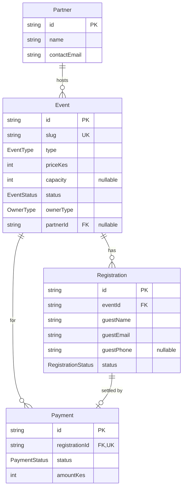

# SMC Website — System Schema & Data Reference

> **Project:** Strathmore Marketing Club (SMC) — "The Agency"
> **What this doc is:** The *structural* reference — the database schema field-by-field, the API surface, the routes, the env vars, and where content lives. **If you change the system's structure, update this file in the same PR.**
> **Companion doc:** [`ARCHITECTURE.md`](ARCHITECTURE.md) holds the *runtime* view (request flows, diagrams, deploy, security). This doc describes *what the data and endpoints are*; that one describes *how a request moves through them*.
>
> **Last updated:** 2026-06-03 · **Maintainers:** SMC dev team

---

## Table of contents

1. [Overview](#1-overview)
2. [Tech stack](#2-tech-stack)
3. [Repository layout](#3-repository-layout)
4. [Two data sources (read this first)](#4-two-data-sources-read-this-first)
5. [Database schema](#5-database-schema)
6. [API reference](#6-api-reference)
7. [Frontend routes & components](#7-frontend-routes--components)
8. [Static content files](#8-static-content-files)
9. [Environment variables](#9-environment-variables)
10. [Local development](#10-local-development)
11. [How to change the schema](#11-how-to-change-the-schema)
12. [Roadmap / phases](#12-roadmap--phases)
13. [Conventions & gotchas](#13-conventions--gotchas)

---

## 1. Overview

A Next.js marketing-and-events website for the Strathmore Marketing Club. It has two halves:

- **Public marketing site** — home, membership, portfolio, team, and an events page.
- **Events system** — browse events and **RSVP to free events anonymously** (just a name + email, optional phone); (future) pay for paid events via M-Pesa.

The events flow is backed by a real database (Prisma + Postgres). The membership / portfolio / team pages are rendered from static content files committed to the repo.

> ⚠️ **There is no sign-in.** This system has **no user accounts, no passwords, and no login/sessions.** Anyone can browse the site and RSVP to a free event by entering their details on the event. RSVPs are de-duplicated per event by email.

---

## 2. Tech stack

| Layer | Choice | Notes |
|---|---|---|
| Framework | **Next.js 16.2.6** (App Router) | ⚠️ This is a newer Next than most tutorials — file conventions differ (see [§13](#13-conventions--gotchas)). |
| Language | **TypeScript 5**, **React 19.2** | Strict mode on. |
| ORM | **Prisma 7.8** | Runtime adapter picks Postgres or SQLite by `DATABASE_URL`. |
| Database | **PostgreSQL** (Supabase) in prod; **SQLite** for offline dev | |
| Validation | **Zod 4** | Shared schemas in `src/backend/validators` (e.g. the RSVP form payload). |
| Styling | **Tailwind CSS v4** | Via `@tailwindcss/postcss`. |
| Animation | **Framer Motion**, **Lenis** | Lenis = smooth scroll. |
| Fonts | League Spartan, Montserrat, Rozha One | Google Fonts via `next/font`. |
| Hosting | **Vercel** | |

---

## 3. Repository layout

```
SMC-Website/
├── prisma/
│   ├── schema.prisma            # ← THE database schema (source of truth)
│   ├── prisma.config.ts         # Prisma CLI config (loads .env, sets seed cmd)
│   └── migrations/              # Generated SQL migrations — do not hand-edit applied ones
├── src/
│   ├── app/                     # Next.js App Router (routes)
│   │   ├── (public)/            # Public marketing pages  → /, /events, /membership, /portfolio, /team
│   │   ├── api/                 # Backend API route handlers
│   │   └── layout.tsx           # Root layout (providers, Navbar, Footer)
│   ├── backend/
│   │   ├── db/                  # Prisma client + seed script
│   │   └── validators/          # Zod schemas (RSVP payload)
│   ├── components/              # React components (UI)
│   ├── data/                    # Static content (team, portfolio, membership)
│   └── lib/                     # Fonts and shared helpers
├── public/                      # Static assets (logos, svgs)
├── .env.example                 # Copy to .env and fill in
└── SCHEMA.md                    # ← this file
```

---

## 4. Two data sources (read this first)

This is the most important thing to understand before editing content. **The site pulls content from two different places**, depending on the page:

| Page / component | Source | How to change its content |
|---|---|---|
| **Events** (`/events`, `components/Events.tsx`) | **Database** via `/api/events` | Add/edit rows in the DB (seed file or admin/DB tool). |
| **Membership** (`components/Membership.tsx`) | **Static file** `src/data/membership.ts` | Edit the TypeScript array. |
| **Portfolio** (`components/Portfolio.tsx`) | **Static file** `src/data/portfolio.ts` | Edit the TypeScript array. |
| **Team** (`components/Team.tsx`) | **Static file** `src/data/team.ts` | Edit the TypeScript array. |

> ⚠️ **Note:** `src/data/events.ts` also exists but is **currently unused** by any component (the live Events UI reads the database instead). Treat the database as the source of truth for events. If you delete or repurpose `data/events.ts`, nothing breaks today — but confirm with a search first.

---

## 5. Database schema

Defined in [`prisma/schema.prisma`](prisma/schema.prisma). Provider: **PostgreSQL**. All primary keys are **cuid** strings.

### Entity-relationship diagram



### Enums

| Enum | Values | Default |
|---|---|---|
| `EventType` | `FREE`, `PAID` | `FREE` |
| `EventStatus` | `DRAFT`, `PUBLISHED`, `CANCELLED` | `DRAFT` |
| `OwnerType` | `INTERNAL`, `PARTNER` | `INTERNAL` |
| `RegistrationStatus` | `RESERVED`, `CONFIRMED`, `CANCELLED` | `RESERVED` |
| `PaymentStatus` | `PENDING`, `SUCCESS`, `FAILED`, `TIMEOUT` | `PENDING` |

### `Partner`

External brand/agency that can own (sponsor) paid events.

| Field | Type | Constraints | Notes |
|---|---|---|---|
| `id` | String | PK, `cuid()` | |
| `name` | String | | |
| `contactEmail` | String | | |
| `contactPhone` | String | | |
| `createdAt` | DateTime | default `now()` | |
| `events` | Event[] | relation | |

### `Event`

| Field | Type | Constraints | Notes |
|---|---|---|---|
| `id` | String | PK, `cuid()` | |
| `slug` | String | **unique** | URL identifier, e.g. `marketing-week`. |
| `title` | String | | |
| `description` | String | | |
| `category` | String | | Free text, e.g. `Flagship`, `Workshop`. |
| `type` | `EventType` | default `FREE` | `PAID` events require the payment flow. |
| `priceKes` | Int | default `0` | Price in Kenyan shillings. |
| `capacity` | Int? | nullable | `null` = unlimited. |
| `startsAt` | DateTime | | |
| `location` | String | | |
| `status` | `EventStatus` | default `DRAFT` | **Only `PUBLISHED` events are exposed by the API.** |
| `ownerType` | `OwnerType` | default `INTERNAL` | |
| `partnerId` | String? | FK → `Partner.id`, nullable | Set when `ownerType = PARTNER`. |
| `commissionRate` | Float | default `0.15` | SMC's cut on partner-paid events. |
| `createdAt` | DateTime | default `now()` | |
| `registrations` | Registration[] | relation | |
| `payments` | Payment[] | relation | |

### `Registration`

A guest's RSVP to an event. **There is no user account** — the RSVP captures the guest's contact details directly on submit.

| Field | Type | Constraints | Notes |
|---|---|---|---|
| `id` | String | PK, `cuid()` | |
| `eventId` | String | FK → `Event.id` | |
| `guestName` | String | | Captured from the RSVP form. |
| `guestEmail` | String | | Stored lowercased. Dedupe key (with `eventId`). |
| `guestPhone` | String? | nullable | Optional contact number. |
| `status` | `RegistrationStatus` | default `RESERVED` | Free RSVPs jump straight to `CONFIRMED`. |
| `createdAt` | DateTime | default `now()` | |
| `payment` | Payment? | relation | One payment per registration (paid events). |

**Composite unique:** `@@unique([eventId, guestEmail])` — **one RSVP per email per event.** Re-submitting the same email on the same event re-activates a previously `CANCELLED` row; an already-active duplicate returns `409`.

### `Payment`

⚠️ **Scaffolded for Phase 3 (M-Pesa) — no API writes to this table yet.** Fields mirror the Daraja STK-push callback shape.

| Field | Type | Constraints | Notes |
|---|---|---|---|
| `id` | String | PK, `cuid()` | |
| `registrationId` | String | **unique**, FK → `Registration.id` | One payment per registration. |
| `eventId` | String | FK → `Event.id` | Denormalized for reporting. |
| `amountKes` | Int | | |
| `status` | `PaymentStatus` | default `PENDING` | |
| `provider` | String | default `"MPESA"` | |
| `merchantRequestId` | String? | | From Daraja. |
| `checkoutRequestId` | String? | **unique** | From Daraja STK push. |
| `mpesaReceiptNumber` | String? | | Confirmation code. |
| `phone` | String? | | Payer MSISDN. |
| `rawCallback` | Json? | | Full callback payload for audit. |
| `commissionKes` | Int? | | SMC share (= `amountKes × commissionRate`). |
| `partnerShareKes` | Int? | | Remainder to the partner. |
| `createdAt` | DateTime | default `now()` | |
| `updatedAt` | DateTime | `@updatedAt` | |

### Foreign-key delete rules

From the initial migration ([`prisma/migrations/.../migration.sql`](prisma/migrations/)):

| Relation | On delete |
|---|---|
| `Event.partnerId → Partner` | `SET NULL` (event survives if partner removed) |
| `Registration.eventId → Event` | `RESTRICT` |
| `Payment.registrationId → Registration` | `RESTRICT` |
| `Payment.eventId → Event` | `RESTRICT` |

`RESTRICT` means you cannot delete a parent row while children reference it — cancel/soft-delete via status fields instead.

---

## 6. API reference

All handlers live under `src/app/api/`. Responses are JSON. **Every endpoint is public — there is no authentication.**

| Method | Path | Description |
|---|---|---|
| `GET` | `/api/events` | List all `PUBLISHED` events, sorted by `startsAt` asc, with `spotsRemaining`. |
| `GET` | `/api/events/[slug]` | Single `PUBLISHED` event (404 otherwise). Includes `partnerName`. |
| `POST` | `/api/events/[slug]/rsvp` | **Anonymous RSVP** to a **FREE** event. Capacity-checked in a transaction. |

### Notable behaviors & status codes

**`POST /api/events/[slug]/rsvp`**
- **Body** (JSON): `{ "name": string, "email": string, "phone"?: string }`. Validated with `rsvpSchema` (`name` ≥ 2 chars, valid `email`, `phone` optional). Email is **lowercased** before use.
- **Status codes:** `404` event missing/unpublished · `400` invalid body **or** event is `PAID` (use the payment flow) · `409` email already registered for this event **or** event full · `201` created · `200` re-activated a previously cancelled RSVP.
- **Dedupe:** one active registration per `(eventId, guestEmail)`. A repeat submit with the same email re-activates a cancelled row, otherwise returns `409`.
- **Capacity** is enforced **inside a Prisma `$transaction`** (re-counts active registrations right before insert) to avoid overbooking races.
- Free RSVPs are created with `status = CONFIRMED`.

**`GET /api/events`** response item shape:

```jsonc
{
  "id", "slug", "title", "description", "category",
  "type", "priceKes", "capacity",
  "spotsRemaining",   // capacity - active registrations, or null if uncapped
  "startsAt",         // ISO string
  "location", "ownerType"
}
```

---

## 7. Frontend routes & components

Routes use **App Router route groups** (the `(name)` folders don't appear in the URL).

| URL | File | Renders |
|---|---|---|
| `/` | `app/(public)/page.tsx` | `HeroHome`, `MissionVision`, `OurStory`, `InsideAgency` |
| `/events` | `app/(public)/events/page.tsx` | `Events` (DB-backed) |
| `/membership` | `app/(public)/membership/page.tsx` | `Membership` (static) |
| `/portfolio` | `app/(public)/portfolio/page.tsx` | `Portfolio` (static) |
| `/team` | `app/(public)/team/page.tsx` | `Team` (static) |

> There are **no auth routes** (`/login`, `/register`) and **no protected routes**. "Join the Club" CTAs in the Navbar and hero point to `/membership` (the static info page), not a signup flow.

**Root layout** (`app/layout.tsx`) wraps every page in provider order:
`ThemeProvider` (light/dark, persisted to `localStorage`) → `LenisProvider` (smooth scroll) → `Navbar` … `Footer`.

**UI building blocks** live in `src/components/ui/` (e.g. `Button`, `Countdown`, `CountUp`, `DetailModal`, `Reveal`, `StatCard`).

---

## 8. Static content files

Edit these arrays to change site copy (no DB or deploy migration needed — just a code change + redeploy):

| File | Exported | Drives |
|---|---|---|
| `src/data/team.ts` | `team: TeamMember[]` | Team page cards & bios. |
| `src/data/portfolio.ts` | `projects: Project[]`, `projectCategories` | Portfolio case studies + filter. |
| `src/data/membership.ts` | `benefits: Benefit[]` | Membership benefits. |
| `src/data/events.ts` | `events`, `getNextEvent()`, `eventTags` | **Currently unused** — see [§4](#4-two-data-sources-read-this-first). |

Each file defines a TypeScript `interface` at the top — follow its shape when adding entries.

---

## 9. Environment variables

Copy `.env.example` → `.env` and fill in. See [`.env.example`](.env.example).

| Variable | Required | Purpose |
|---|---|---|
| `DATABASE_URL` | ✅ | Postgres connection string (Supabase) **or** `file:./dev.db` for local SQLite. The Prisma client picks the adapter from this prefix. |
| `MPESA_*` | Phase 3 | Daraja consumer key/secret, shortcode, passkey, callback URL, env. Not used yet. |

---

## 10. Local development

```bash
npm install

# 1. Set up env
cp .env.example .env          # then edit DATABASE_URL

# 2. Apply migrations (creates tables)
npm run db:migrate

# 3. Seed demo data (a partner + 4 events)
npm run db:seed

# 4. Run the dev server
npm run dev                   # http://localhost:3000
```

| Script | Does |
|---|---|
| `npm run dev` | Start Next dev server. |
| `npm run build` | `prisma generate` + `next build`. |
| `npm run db:migrate` | `prisma migrate dev` — create/apply a migration. |
| `npm run db:seed` | Run the seed script. |
| `npm run db:studio` | Open Prisma Studio (browse/edit the DB). |
| `npm run lint` | ESLint. |

> **Tip:** for offline work set `DATABASE_URL="file:./dev.db"` to use local SQLite — no Supabase needed.

---

## 11. How to change the schema

The database schema is owned by [`prisma/schema.prisma`](prisma/schema.prisma). To change it:

1. **Edit `schema.prisma`** — add/modify a model, field, or enum.
2. **Create a migration:**
   ```bash
   npm run db:migrate          # prompts for a migration name
   ```
   This generates SQL under `prisma/migrations/` and applies it to your dev DB.
3. **Regenerate the client** — `db:migrate` does this; otherwise `npx prisma generate`.
4. **Update seed/API code** if the change affects them.
5. **Update this file** — edit [§5](#5-database-schema) so the tables match reality.
6. **Commit** `schema.prisma` **and** the generated migration folder together.

**Do not** hand-edit a migration that has already been applied/committed — create a new one. **Do not** edit the generated Prisma client in `node_modules`.

Deploying to prod runs migrations against Supabase Postgres; make sure new migrations are committed before the Vercel build.

> ⚠️ **Destructive migrations:** the `remove_auth_anonymous_rsvp` migration **drops the `User` table** and adds `NOT NULL` guest columns to `Registration`. On a database that already has registration rows it will fail without a backfill. Apply it deliberately against prod (it's safe on an empty/fresh DB).

---

## 12. Roadmap / phases

The schema is built ahead of the UI in phases:

| Phase | Scope | Status |
|---|---|---|
| 1 | Public marketing site | ✅ Done |
| 2 | **Anonymous** free-event RSVP + capacity | ✅ Done |
| 3 | **Paid events via M-Pesa** (`Payment` table, Daraja STK push, callbacks, commission split) | 🚧 Scaffolded (model + env placeholders), not wired up |
| — | Admin area for managing events (today: seed script / DB tools only) | 🔒 Not built |

---

## 13. Conventions & gotchas

- **Next.js 16 is not the Next.js you remember.** Per `AGENTS.md`, APIs and file conventions differ from older tutorials and training data — check `node_modules/next/dist/docs/` before relying on memory.
- **Dynamic route `params` are async.** Handlers receive `{ params: Promise<{ slug: string }> }` — you must `await params`.
- **Prisma client is lazy + a singleton** (`src/backend/db/prisma.ts`). It's a `Proxy` that instantiates on first use and caches on `globalThis` (prevents connection storms in dev/serverless). It selects the **SQLite adapter** when `DATABASE_URL` starts with `file:`, otherwise the **Postgres adapter**.
- **Path alias:** `@/*` → `src/*` (see `tsconfig.json`).
- **Events: only `PUBLISHED` rows are public.** A new event defaults to `DRAFT` and won't appear until you flip its status.
- **RSVP dedupe key is `(eventId, guestEmail)`** — emails are lowercased; one active RSVP per email per event. Re-RSVP with the same email re-activates a cancelled row.
- **Public RSVP endpoint is unauthenticated** — it should be rate-limited before launch (see [`ARCHITECTURE.md` §8](ARCHITECTURE.md#8-security-architecture)).
- **Money is stored as integer KES** (`priceKes`, `amountKes`) — no floats for currency.

---

> **Editing this doc:** keep the tables in sync with `prisma/schema.prisma` and the API handlers. When in doubt, the code is the source of truth — this file is the map. For *how requests flow* (not *what the data is*), see [`ARCHITECTURE.md`](ARCHITECTURE.md).
